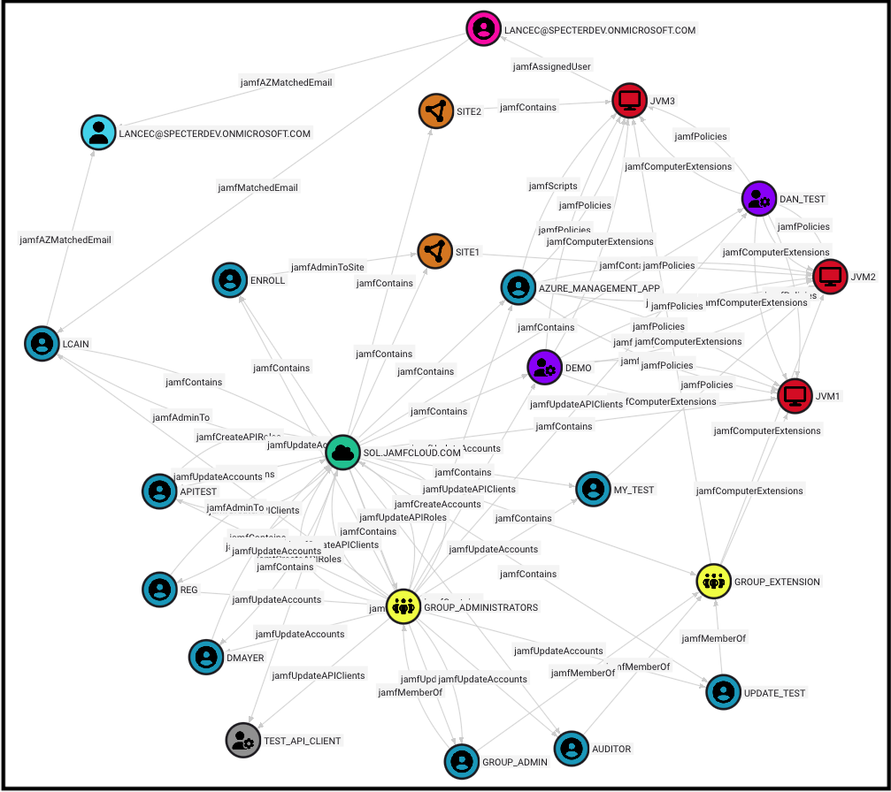
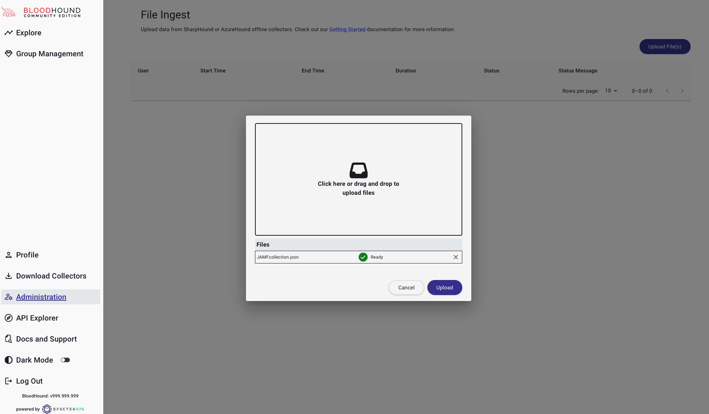

# JamfHound

## About
JamfHound is a python3 project designed to collect and identify attack paths in Jamf Pro tenants based on existing object permissions. When run the scripts create JSON object files that can be imported into BloodHound instances to populate custom nodes such as Jamf accounts or computers and display edges between those nodes to reveal different methods of control or code execution available. JamfHound can perform collections against both cloud-hosted and on-site Jamf Pro instances using known credentials. Users are recommended to provision auditor accounts to perform collections which is a pre-defined role that will have the necessary permissions to read all resources to be collected.

Example Graph Collection

## Getting Started

To visualize and use the JSON files created from JAMFhound collections, users will need a BloodHound instance available. Setup and use of BloodHound has been documented [here.](https://bloodhound.specterops.io/get-started/introduction) Access to a local administrator account within BloodHound will be needed to create custom icons and upload new data. BloodHound will need to be updated to support OpenGraph custom objects.
### Dependencies
* Python3 - version 3.9 or newer
* Requests Module
  
### Installation
**Note:** JAMFhound is recommended to be used with a Python3 virtual environment to ease the installation of dependencies and maintaining changes. 
1. Install the venv module using pip: `python3 -m pip install venv`
2. Create a new virtual environment: `python3 -m venv /path/to/new/virtual/environment`
3. Source the activation script: `source /path/to/new/virtual/environment/bin/activate`

Begin by clonining the JAMFhound repository to the local directory:
* `git clone https://github.com/SpecterOps/JAMFhound.git`

Install requests via pip:
* `python3 -m pip install requests`

Update line 4 of JAMFhound/lib/create_jamf_icons.py to replace 127.0.0.1 with the IP or Domain name of your BloodHound server:
* `url = "http://127.0.0.1:8080/api/v2/custom-nodes"`

Obtain a bearer token for the local BloodHound instance and add it to line 7 of JAMFhound/lib/create_jamf_icons.py:
* `"Authorization": "Bearer ey...",`

Run JAMFhound/lib/create_jamf_icons.py to insert the custom icons and colors for JAMF objects into your BloodHound instance:
* `python3 JAMFhound/lib/create_jamf_icons.py`

## Usage
JAMFhound currently collects a variety of information from JAMF including computer details, account information, api clients, sites, and groups. In its current state collections must be run with an account capable of collecting these objects which typically are auditors and administrator accounts.

Perform a collection of a cloud hosted tenant:
* `python3 main.py --username auditor --password "auditorPASS" --target https://mytenant.jamfcloud.com --collect`

Perform a collection of an onsite tenant:
* `python3 main.py --username auditor --password "auditorPASS" --target https://mytenant.local:8443 --collect`

Upload the JAMFcollection.json file to BloodHound using the file ingestion interface:

Use the custom cypher queries contained in the JamfHound repository to view and parse data using the Cypher tab of the BloodHound interface. 

Note: Uploads of multiple JAMF tenants that use the same domain name may result in unexpected node collisions. While this is extremely rare, if you have multiple tenants you wish to collect that use the same URL/domain name for access, use either multiple BH instances or delete data between collections. 

## Contributors
Credit to the following team members for their significant contributions in designing and developing JAMFhound as an initial proof-of-concept.
* Lance Cain - (aka robot/RobotOperator)
* West Shepherd - (aka WestShepherd)
* Craig Wright - (aka werdhaihai)
* JD Crandell - (aka jd580)

-----

#### Deprecated Functionality
JAMFhound was originally developed during a SpecterOps 24-hour hackathon that included multiple proofs-of-concept for identifying dangerous permissions within a JAMF tenant as well as initially mapping relationships within a Neo4j database. The capability to gather information such as the current user permissions that will be written out to unique JSON still exists within this project with examples included below, however, that functionality is not intended to be maintained nor expanded upon in the future and may eventually be removed from the project without notice. SpecterOps has sponsored a separate project, [Eve](https://github.com/RobotOperator/Eve), which performs similar functionality and is intended to be a maintained alternative capable of targeted enumeration actions and more.

##### Users & Accounts - Deprecated
Retrieve current user sites and permissions: `python main.py -u 'jd' -p 'EXAMPLE123' --url 'https://tenant.jamfcloud.com' -me`
    
Filter current user site permissions by name: `python main.py -u 'jd' -p 'EXAMPLE123' --url 'https://tenant.jamfcloud.com' -me --site NONE`

Retrieve current accounts site names: `python main.py -u 'jd' -p 'EXAMPLE123' --url 'https://tenant.jamfcloud.com' --sites`

Retrieve all account permissions and save to `accounts.json`: `python main.py -u 'jd' -p 'EXAMPLE123' --url 'https://tenant.jamfcloud.com' --accounts --save`

Retrieve account by ID: `python main.py -u 'jd' -p 'EXAMPLE123' --url 'https://tenant.jamfcloud.com' --account 1`

Retrieve user by ID: `python main.py -u 'jd' -p 'EXAMPLE123' --url 'https://tenant.jamfcloud.com' --user 1`

##### Computers - Deprecated
Retrieve computer by ID: `python main.py -u 'jd' -p 'EXAMPLE123' --url 'https://tenant.jamfcloud.com' --computer 1`

Retrieve all computers and save to `computers.json`:  `python main.py -u 'jd' -p 'EXAMPLE123' --url 'https://tenant.jamfcloud.com' --computers --save`

##### Policies - Deprecated
Retrieve policy by ID: `python main.py -u 'jd' -p 'EXAMPLE123' --url 'https://tenant.jamfcloud.com' --policy 1`

Retrieve all policies and save to `policies.json`:  `python main.py -u 'jd' -p 'EXAMPLE123' --url 'https://tenant.jamfcloud.com' --policies --save`
